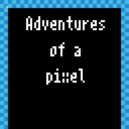
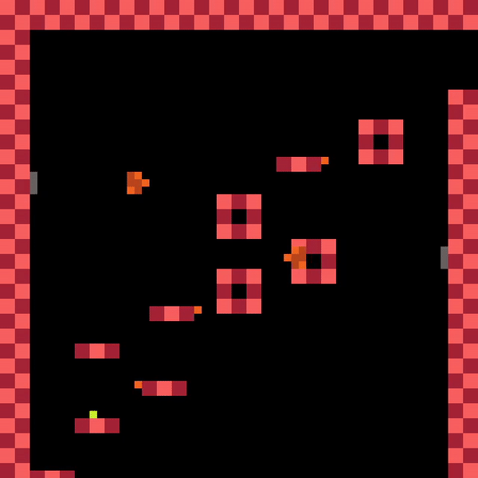

# Adventures of a pixel

## Be the pixel

A tiny plattformer made for lowrezjam 2020. Get it on [itch.io](https://captain4lk.itch.io/adventures-of-a-pixel) (the windows version at least)!

## Used assets/music

All assets made by me are in the public domain, furthermore only public domain assets and music have been used.

|Source|License|Author|
|---|---|---|
|[Bittersweet 27](https://opengameart.org/content/bittersweet-27)|[CC0](https://creativecommons.org/publicdomain/zero/1.0/)|[DJ CrisP](https://opengameart.org/users/dj-crisp)|
|[Challenge Accepted](https://opengameart.org/content/bittersweet-27)|[CC0](https://creativecommons.org/publicdomain/zero/1.0/)|[DJ CrisP](https://opengameart.org/users/dj-crisp)|
|[City Mega Pack](https://opengameart.org/content/city-mega-pack)|[CC0](https://creativecommons.org/publicdomain/zero/1.0/)|[GrafxKid](https://opengameart.org/users/grafxkid)|
|[Retro Lines - 16x16 PLatformer Assets](https://opengameart.org/content/retro-lines-16x16-platformer-assets)|[CC0](https://creativecommons.org/publicdomain/zero/1.0/)|[VEXED](https://opengameart.org/users/vexed)|
|[New original Grafx2 font collection](https://opengameart.org/content/new-original-grafx2-font-collection) [4x8mono]|[CC0](https://creativecommons.org/publicdomain/zero/1.0/)|[usr_share](https://opengameart.org/users/usrshare)|
